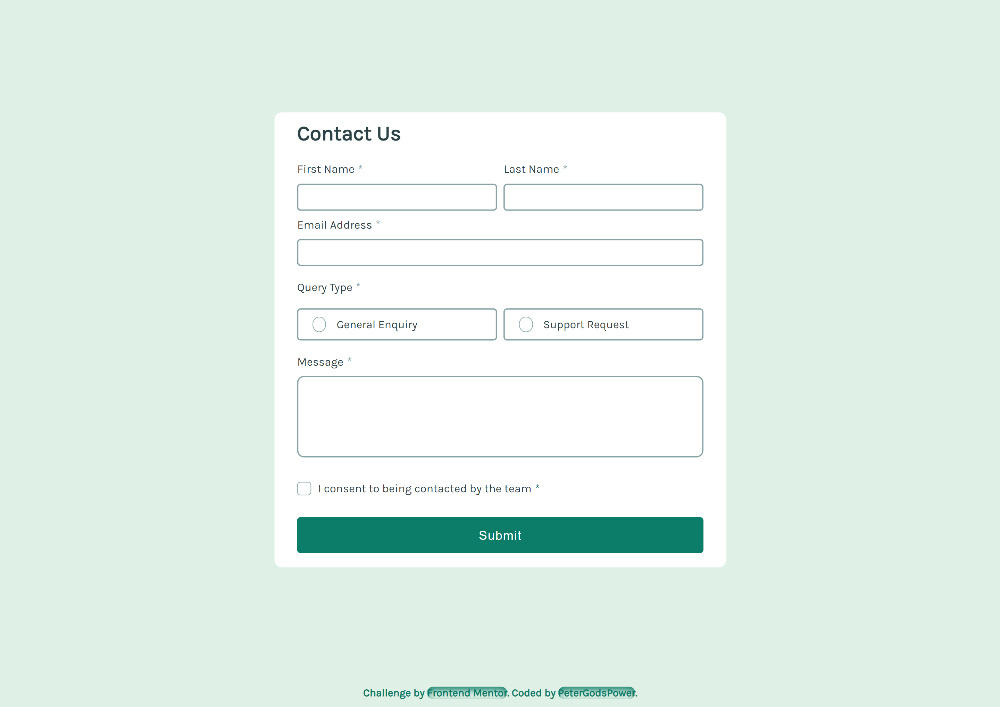
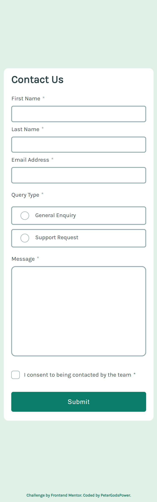

# Frontend Mentor | Contact Form

This is a solution to the Contact Form challenge on Frontend Mentor. The project involves creating an interactive contact form with various input types and validations to ensure user data is collected accurately.

## Table of Contents

- [Overview](#overview)
  - [Screenshot](#screenshot)
  - [Links](#links)
- [My Process](#my-process)
  - [Built With](#built-with)
  - [What I Learned](#what-i-learned)
  - [Continued Development](#continued-development)
  - [Useful Resources](#useful-resources)
- [Author](#author)
- [Acknowledgments](#acknowledgments)

## Overview

### Screenshot

### Links

- Solution URL: [Frontend Mentor Solution](https://www.frontendmentor.io/solutions/contact-form)
- Live Site URL: [Live Demo](https://your-live-site-url.com) <!-- Update with actual URL -->

## My Process

I developed a contact form component that includes input fields for first name, last name, email, query type, message, and terms agreement. The form features real-time validation with error messages and visual feedback to guide users through the submission process.

### Built With

- **Semantic HTML5 Markup:** Employed modern HTML elements to structure the contact form, improving readability and accessibility.
- **CSS Custom Properties:** Utilized CSS variables for color and font management, ensuring consistency and easy theming.
- **Flexbox and Grid:** Applied for layout and alignment to maintain a responsive design across different devices.
- **Responsive Design:** Used `clamp()` for fluid typography and media queries to adapt the layout to various screen sizes.
- **JavaScript:** Managed form validation and interactive feedback, including error handling and visual cues for form state.

### What I Learned

This project enhanced my skills in:

- **Form Validation:** Implementing client-side validation to ensure user inputs are correct before submission.
- **Responsive Design:** Utilizing CSS techniques for creating layouts that work across a range of devices.
- **JavaScript Event Handling:** Effectively managing form interactions and dynamic updates.
- **Best Practices:** Organizing and structuring code for maintainability and performance.

### Continued Development

Future improvements will focus on:

- **Advanced Validation Techniques:** Incorporating more sophisticated validation rules and real-time feedback.
- **Enhanced Accessibility:** Ensuring the form is fully accessible to all users, including those using assistive technologies.
- **UI/UX Enhancements:** Refining the user experience with more interactive elements and improved visual design.

### Useful Resources

- [MDN Web Docs](https://developer.mozilla.org/en-US/) - Comprehensive documentation for web technologies.
- [CSS-Tricks](https://css-tricks.com/) - Articles and tutorials on modern CSS practices.
- [Frontend Mentor](https://www.frontendmentor.io/) - Platform for frontend coding challenges and community feedback.

## Author

- **Frontend Mentor:** [@YourProfile](https://www.frontendmentor.io/profile/YourProfile)
- **GitHub:** [YourGitHubUsername](https://github.com/YourGitHubUsername)

## Acknowledgments

Special thanks to Frontend Mentor for providing this challenge and to the community for their constructive feedback and support.
